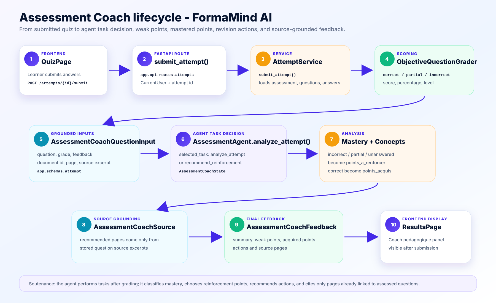

# Assessment Coach Lifecycle

This document explains the agentic feedback flow that runs after a learner
submits an assessment attempt.

Visual schema:



## What Changed

The `AssessmentAgent` still generates assessments with CrewAI, but it now also
performs a second educational task:

```text
analyze_attempt -> recommend_reinforcement
```

This means the agent does not only create quiz questions. It also analyzes a
completed attempt, detects weak and mastered points, recommends revision actions,
and cites the source pages to review.

## Main Classes

- `app.api.routes.attempts.submit_attempt`
- `AttemptService`
- `ObjectiveQuestionGrader`
- `AssessmentAgent`
- `AssessmentCoachState`
- `AssessmentCoachFeedback`
- `AssessmentCoachQuestionInput`
- `AssessmentCoachSource`

## Step By Step

1. The learner submits an assessment attempt.
2. `submit_attempt()` calls `AttemptService.submit_attempt()`.
3. `AttemptService` grades objective questions deterministically.
4. Open answers are evaluated through `AssessmentAgent.evaluate_open_answers()`.
5. The service calculates score, percentage, and level.
6. The service builds one `AssessmentCoachQuestionInput` per scored question.
7. `AssessmentAgent.analyze_attempt()` decides the task:
   - `analyze_attempt` when the result is mostly mastered.
   - `recommend_reinforcement` when weak points exist.
8. The agent decides the mastery level:
   - `weak` below 55%.
   - `medium` from 55% to 74%.
   - `strong` from 75%.
9. Incorrect, partial, and unanswered questions become `points_a_renforcer`.
10. Correct questions become `points_acquis`.
11. Recommended sources come only from the stored question source excerpts.
12. The frontend shows the coach feedback on the results page.

## Why This Is Agentic

The agent now performs tasks and decisions:

- selects the feedback task;
- classifies mastery level;
- detects concepts to reinforce;
- detects acquired concepts;
- chooses recommended source pages;
- produces next revision actions;
- keeps an internal `AssessmentCoachState`.

The feedback does not depend on private reasoning or hallucinated sources. It is
grounded in:

- scored questions;
- learner answers;
- deterministic grades;
- source document IDs;
- source pages;
- source excerpts.

