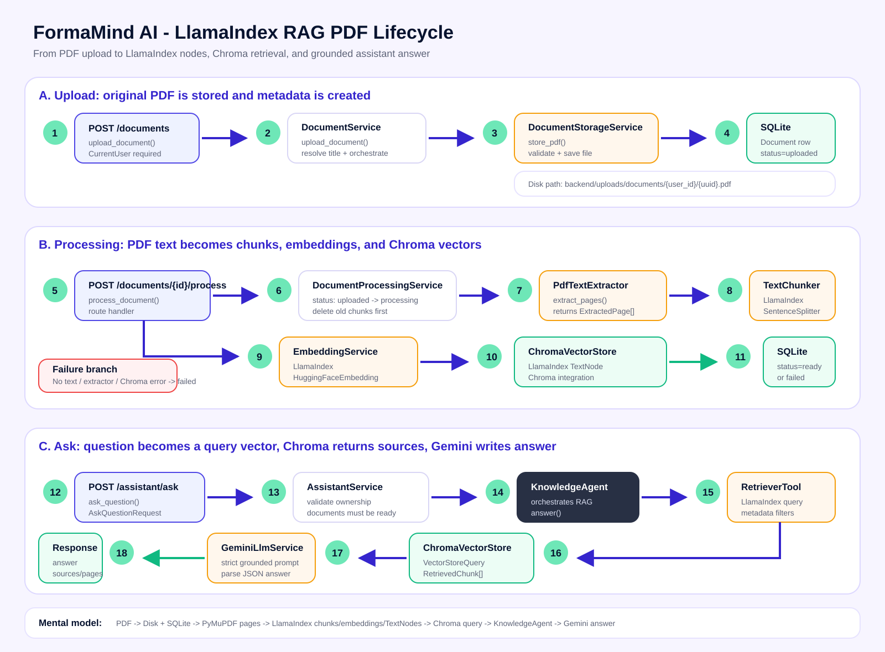

# Feature 04 - LlamaIndex RAG and Knowledge Agent Lifecycle

This document explains the backend lifecycle of a PDF in the FormaMind AI RAG
feature after the migration to LlamaIndex.

Visual schema:



## What Changed

The FormaMind API contract did not change. The frontend still calls:

```http
POST /api/v1/documents
POST /api/v1/documents/{document_id}/process
POST /api/v1/assistant/ask
```

The internal RAG implementation changed:

- Text splitting now uses `llama_index.core.node_parser.SentenceSplitter`.
- Embeddings now use `llama_index.embeddings.huggingface.HuggingFaceEmbedding`.
- Chroma writes/searches now go through
  `llama_index.vector_stores.chroma.ChromaVectorStore`.
- FormaMind still owns auth, document permissions, status lifecycle, API
  schemas, error handling, and the `KnowledgeAgent` orchestration class.

## 1. Upload PDF

Endpoint:

```http
POST /api/v1/documents
```

Main classes:

- `app.api.routes.documents.upload_document`
- `DocumentService`
- `DocumentStorageService`
- `DocumentRepository`
- `Document`

What happens:

1. The authenticated user sends a PDF.
2. `upload_document()` receives the `UploadFile`.
3. `DocumentService.upload_document()` coordinates storage and DB metadata.
4. `DocumentStorageService.store_pdf()` validates:
   - filename ends with `.pdf`
   - MIME type is `application/pdf`
   - file is not empty
   - file size does not exceed `MAX_UPLOAD_SIZE_MB`
   - file starts with `%PDF-`
   - PyMuPDF can open the PDF and count pages
5. The PDF is saved to disk:

```text
backend/uploads/documents/{user_id}/{uuid}.pdf
```

6. `DocumentRepository.create()` creates a SQLite `Document` row with:

```text
status = uploaded
```

At this point, the PDF exists on disk and SQLite has metadata, but the assistant
cannot use it yet.

## 2. Process PDF With LlamaIndex

Endpoint:

```http
POST /api/v1/documents/{document_id}/process
```

Main classes:

- `app.api.routes.documents.process_document`
- `DocumentProcessingService`
- `PdfTextExtractor`
- `TextChunker`
- `EmbeddingService`
- `ChromaVectorStore`
- `ProcessDocumentResponse`

LlamaIndex components used:

- `llama_index.core.Document`
- `llama_index.core.node_parser.SentenceSplitter`
- `llama_index.embeddings.huggingface.HuggingFaceEmbedding`
- `llama_index.core.schema.TextNode`
- `llama_index.vector_stores.chroma.ChromaVectorStore`

What happens:

1. The user clicks "Analyser le document".
2. `DocumentProcessingService.process_document()` checks ownership and state.
3. Allowed previous statuses are:

```text
uploaded, failed, ready
```

4. The document status becomes:

```text
processing
```

5. `ChromaVectorStore.delete_document_chunks()` removes old chunks for this
   user/document pair. Re-processing a PDF is therefore safe.
6. `DocumentStorageService.path_for_key()` resolves the PDF path safely.
7. `PdfTextExtractor.extract_pages()` reads page text with PyMuPDF.
8. `TextChunker.chunk_pages()` creates one LlamaIndex `Document` per page and
   splits it with `SentenceSplitter`.
9. The resulting chunks are converted back to FormaMind `TextChunk` schemas so
   the rest of the backend keeps stable types.
10. `EmbeddingService.embed_texts()` uses LlamaIndex
    `HuggingFaceEmbedding.get_text_embedding_batch()`.
11. `ChromaVectorStore.upsert_chunks()` creates LlamaIndex `TextNode` objects
    with:
    - node id: `document-{document_id}-page-{page_number}-chunk-{chunk_index}`
    - text
    - embedding
    - metadata
12. Metadata uses FormaMind-safe keys to avoid collisions with LlamaIndex
    reserved fields:

```text
formamind_user_id
formamind_document_id
document_title
page_number
chunk_index
```

13. `llama_index.vector_stores.chroma.ChromaVectorStore.add()` persists nodes in
    Chroma.
14. If everything succeeds, the document status becomes:

```text
ready
```

15. The endpoint returns:

```text
document_id, status, page_count, chunk_count, message
```

## 3. Failure States

Main error classes:

- `DocumentNotProcessableError`
- `NoUsableTextError`
- `DocumentProcessingError`
- `PdfTextExtractionError`
- `VectorStoreError`

Important statuses:

- `uploaded`: PDF is stored but not processed.
- `processing`: backend is extracting, splitting, embedding, and indexing.
- `ready`: chunks are available in Chroma and assistant can use them.
- `failed`: processing failed and `error_message` explains why.

Common failures:

- PDF has no usable text: status becomes `failed`.
- PDF extraction fails: status becomes `failed`.
- LlamaIndex/Chroma write fails: status becomes `failed`.

## 4. Ask Assistant

Endpoint:

```http
POST /api/v1/assistant/ask
```

Main classes:

- `app.api.routes.assistant.ask_question`
- `AssistantService`
- `DocumentRepository`
- `KnowledgeAgent`
- `RetrieverTool`
- `EmbeddingService`
- `ChromaVectorStore`
- `GeminiLlmService`
- `AskQuestionRequest`
- `AskQuestionResponse`
- `KnowledgeAnswer`
- `SourceCitation`

LlamaIndex components used:

- `HuggingFaceEmbedding.get_query_embedding()`
- `llama_index.core.vector_stores.VectorStoreQuery`
- `MetadataFilter`
- `MetadataFilters`
- `FilterOperator.IN`
- `llama_index.vector_stores.chroma.ChromaVectorStore.query()`

What happens:

1. The user selects ready documents and asks a question.
2. `AssistantService.ask_question()` validates:
   - selected documents belong to the current user
   - selected documents are all `ready`
3. `KnowledgeAgent.answer()` orchestrates the RAG flow.
4. `RetrieverTool.search()` cleans the question.
5. `EmbeddingService.embed_query()` uses LlamaIndex
   `HuggingFaceEmbedding.get_query_embedding()`.
6. `ChromaVectorStore.search()` builds a LlamaIndex `VectorStoreQuery` with
   metadata filters:

```text
formamind_user_id == current_user.id
formamind_document_id IN selected_document_ids
```

7. Chroma returns matching LlamaIndex nodes.
8. The vector store maps nodes back into FormaMind `RetrievedChunk` schemas.
9. `KnowledgeAgent` sends retrieved chunks to `GeminiLlmService`.
10. `GeminiLlmService.generate_grounded_answer()` builds a strict prompt:
    - answer only from selected sources
    - do not use external knowledge
    - return valid JSON
    - cite used pages
11. The response is parsed into `KnowledgeAnswer`.
12. Sources are filtered again to ensure citations match retrieved chunks.
13. API returns `AskQuestionResponse`.

## 5. What Is Custom vs Ready-Made

Ready-made LlamaIndex pieces:

- `SentenceSplitter` for chunking.
- `HuggingFaceEmbedding` for embeddings.
- `TextNode` for vector nodes.
- `ChromaVectorStore` integration for Chroma operations.
- `VectorStoreQuery` and metadata filters for retrieval.

Custom FormaMind pieces:

- Auth and ownership checks.
- Document status lifecycle.
- PDF file storage.
- SQLite document metadata.
- Error mapping to API responses.
- `KnowledgeAgent` orchestration.
- Strict Gemini prompt and JSON parsing.
- Source validation before returning citations.

## 6. Data Stores

SQLite:

```text
backend/formamind.db
```

Stores users and document metadata.

Disk:

```text
backend/uploads/documents
```

Stores original PDF files.

Chroma:

```text
backend/vector_store/chroma.sqlite3
```

Stores LlamaIndex nodes, embeddings, text, and metadata.

Gemini:

```env
GEMINI_API_KEY=...
GEMINI_MODEL=gemini-3.5-flash
```

Generates grounded answers from retrieved chunks.

## 7. Mental Model

Short version:

```text
PDF
-> disk storage
-> SQLite metadata
-> PyMuPDF page text
-> LlamaIndex SentenceSplitter chunks
-> LlamaIndex HuggingFace embeddings
-> LlamaIndex ChromaVectorStore nodes
-> query embedding
-> LlamaIndex VectorStoreQuery
-> retrieved chunks
-> KnowledgeAgent
-> Gemini grounded answer with citations
```

The assistant does not read the raw PDF at question time. It answers from
LlamaIndex/Chroma nodes created during document processing.
