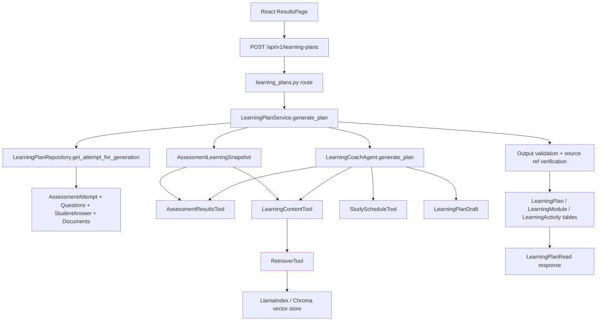

# Feature 07 - Learning Coach Agent Lifecycle

This feature turns evaluated assessment attempts into persistent, source-grounded
learning plans.

## What Was Built

- `LearningCoachAgent` decides how to transform quiz results into modules and
  activities.
- `AssessmentResultsTool` exposes score, weak answers, mastered answers,
  feedback, missing concepts, and source pages.
- `LearningContentTool` searches the selected course documents through the
  existing RAG stack.
- `StudyScheduleTool` builds a deterministic calendar that respects the user's
  available daily minutes.
- `LearningPlanService` validates the agent output, persists the plan, manages
  progress, and protects user ownership.
- React pages let the learner generate, open, track, complete, and delete plans.

## Backend Flow



## Step By Step With Class Names

1. User clicks **Generer mon plan d'apprentissage** in
   `frontend/src/features/assessments/pages/ResultsPage.tsx`.
2. `GenerateLearningPlanPage` sends `GenerateLearningPlanInput` to
   `POST /api/v1/learning-plans`.
3. `backend/app/api/routes/learning_plans.py` receives
   `GenerateLearningPlanRequest` and calls `LearningPlanService`.
4. `LearningPlanRepository.get_attempt_for_generation()` loads the evaluated
   `AssessmentAttempt`, its `Assessment`, `Question`, `StudentAnswer`, and
   selected `Document` records.
5. `LearningPlanService._snapshot_for_attempt()` creates an
   `AssessmentLearningSnapshot`.
6. `AssessmentResultsTool` gives the agent the score, weak topics, strong
   topics, feedback, and missing concepts.
7. `LearningContentTool` searches only the current user's selected documents.
   It returns stable refs such as `CONTENT_SOURCE_1`.
8. `LearningCoachAgent` decides the remediation priorities and creates a
   `LearningPlanDraft`.
9. `LearningPlanService` verifies that every activity cites a real retrieved
   source ref.
10. `StudyScheduleTool` assigns activity dates while respecting
    `daily_minutes`.
11. The service persists:
    `LearningPlan -> LearningModule -> LearningActivity -> LearningActivitySource`.
12. The frontend opens `LearningPlanDetailPage`, where the learner can move
    activities from `pending` to `in_progress` to `completed`.

## Why This Is Agentic

The Learning Coach Agent is not only "RAG plus LLM". It has tools and decisions:

- It reads assessment results before deciding what to plan.
- It prioritizes weak answers and missing concepts.
- It retrieves learning content only for the required remediation topics.
- It generates tasks, not just text answers.
- It uses a scheduler tool to create an actionable timeline.
- The service verifies source refs before saving anything.
- Progress changes are persistent and drive the dashboard recommendation.

## Database Tables

- `learning_plans`: one generated plan for a user attempt.
- `learning_modules`: ordered learning blocks inside a plan.
- `learning_activities`: actionable tasks with status and scheduled date.
- `learning_activity_sources`: document/page/excerpt citations per activity.

## API

- `POST /api/v1/learning-plans`
- `GET /api/v1/learning-plans`
- `GET /api/v1/learning-plans/{plan_id}`
- `PATCH /api/v1/learning-plans/{plan_id}/activities/{activity_id}`
- `DELETE /api/v1/learning-plans/{plan_id}`

## Frontend Pages

- `/learning-plan`: list of generated plans.
- `/learning-plans/new/:attemptId`: guided generation from evaluated results.
- `/learning-plans/:planId`: detailed timeline and progress tracking.

## How To Explain In Soutenance

"After an evaluation is corrected, FormaMind creates a structured learning
snapshot. The Learning Coach Agent uses three tools: one to inspect assessment
results, one to retrieve trusted course passages from Chroma through RAG, and one
to schedule activities. The service validates the agent draft, checks that every
activity is linked to a retrieved source, persists the plan in SQLAlchemy tables,
and updates progress as the learner completes activities."

## Claude Prompt For Diagram Iteration

Use this prompt if you want another AI/design tool to redraw the lifecycle:

```text
Create a clean technical architecture diagram for FormaMind AI Feature 07:
Learning Coach Agent. Show this flow with class/file names:
React ResultsPage -> POST /api/v1/learning-plans -> learning_plans.py route ->
LearningPlanService -> LearningPlanRepository -> AssessmentAttempt/Question/
StudentAnswer/Documents -> AssessmentLearningSnapshot -> AssessmentResultsTool
and LearningContentTool -> RetrieverTool -> LlamaIndex/Chroma ->
LearningCoachAgent -> StudyScheduleTool -> LearningPlanDraft validation ->
LearningPlan/LearningModule/LearningActivity/LearningActivitySource tables ->
LearningPlanDetailPage progress tracking -> Dashboard recommendation.
Use a premium educational AI style, clear numbered steps, and no decorative
noise.
```
