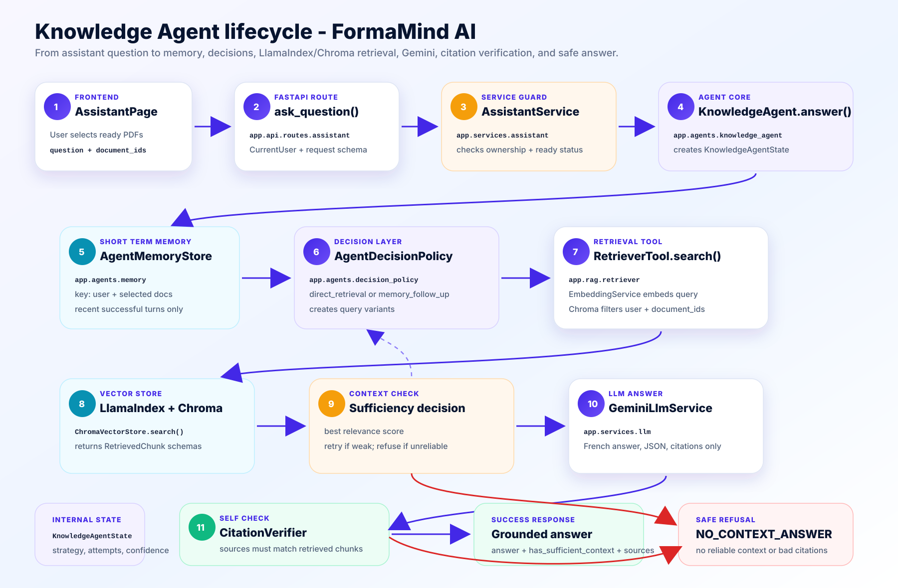

# Knowledge Agent Lifecycle

This document explains the upgraded `KnowledgeAgent` used by:

```http
POST /api/v1/assistant/ask
```

Visual schema:



## Short Version

The first implementation was mostly:

```text
question -> RetrieverTool -> GeminiLlmService -> answer
```

The upgraded version is now:

```text
question
-> memory lookup
-> decision policy
-> retrieval attempt
-> context sufficiency check
-> optional query reformulation + retry
-> Gemini grounded answer
-> citation verification
-> answer or refusal
```

The public API response did not change. The agent still returns:

- `answer`
- `has_sufficient_context`
- `sources`

The new agent state is internal and used to explain/debug the decisions.

## Main Classes

- `app.api.routes.assistant.ask_question`
- `app.services.assistant.AssistantService`
- `app.agents.knowledge_agent.KnowledgeAgent`
- `app.agents.memory.AgentMemoryStore`
- `app.agents.decision_policy.AgentDecisionPolicy`
- `app.agents.grounding.CitationVerifier`
- `app.schemas.agent.KnowledgeAgentState`
- `app.rag.retriever.RetrieverTool`
- `app.rag.embedding_service.EmbeddingService`
- `app.rag.vector_store.ChromaVectorStore`
- `app.services.llm.GeminiLlmService`

## Step By Step

1. The authenticated user asks a question from the assistant page.
2. `ask_question()` receives the request and uses `CurrentUser`.
3. `AssistantService.ask_question()` verifies that selected documents belong to
   the user and are already `ready`.
4. `KnowledgeAgent.answer()` creates an internal `KnowledgeAgentState`.
5. `AgentMemoryStore` looks for recent successful conversation turns for the
   same user and same selected documents.
6. `AgentDecisionPolicy` decides the strategy:
   - `direct_retrieval` for normal questions.
   - `memory_follow_up` for follow-up questions like `explique plus`.
7. If it is a follow-up, the agent reformulates the effective question with the
   previous question context.
8. The policy creates query variants. Example:

```text
C'est quoi RAG ?
rag
C'est quoi RAG ? definition explication
C'est quoi RAG ? points cles exemples
```

9. `RetrieverTool.search()` retrieves chunks from LlamaIndex/Chroma.
10. The agent checks whether the retrieved context is sufficient.
11. If the first context is weak, the agent retries with the next query variant.
12. If no reliable context exists, the agent refuses with the existing
    `NO_CONTEXT_ANSWER`.
13. If context is reliable, `GeminiLlmService.generate_grounded_answer()` asks
    Gemini for a French JSON answer grounded only in the retrieved chunks.
14. `CitationVerifier` checks that:
    - every citation points to a retrieved chunk,
    - the answer text overlaps enough with retrieved context,
    - sources were not invented.
15. If verification fails, the agent refuses instead of hallucinating.
16. If verification passes, the agent stores the turn in short-term memory and
    returns the grounded answer.

## What Makes It More Agentic

The upgraded agent is no longer just a direct RAG wrapper. It now has:

- decision state: strategy, attempts, query variants, confidence, refusal reason;
- memory: recent successful turns per user and selected document set;
- tool-use decisions: when retrieval is weak, it changes the query and retries;
- self-check: answer is verified against retrieved sources before returning;
- refusal behavior: weak or unsupported context returns no-context instead of
  pretending.

## Memory Scope

Memory is intentionally simple for the MVP:

- in-process Python memory, no Redis and no database table;
- key format: `user:{user_id}:documents:{sorted_document_ids}`;
- stores recent `ConversationTurn` items only;
- stores user question, effective question, and the final answer;
- only successful answers are reused for follow-up resolution.

Because memory is in-process, it resets when the backend restarts. That is fine
for the MVP and keeps the system easy to explain.

## Agent State

`KnowledgeAgentState` is internal and contains:

- `selected_strategy`
- `original_question`
- `effective_question`
- `query_variants`
- `retrieval_attempts`
- `selected_source_ids`
- `confidence`
- `refusal_reason`

It is not exposed in the API response, so private decision details do not leak
to the frontend.

## Soutenance Explanation

You can explain it like this:

> The Knowledge Agent is agentic because it does not only call retrieval and an
> LLM. It keeps short-term memory, decides if a question is direct or a follow-up,
> reformulates weak queries, retries retrieval, checks if the retrieved context is
> sufficient, verifies citations, and refuses when the answer is not supported by
> the selected documents.

